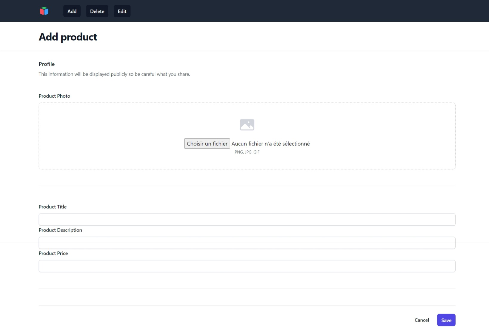
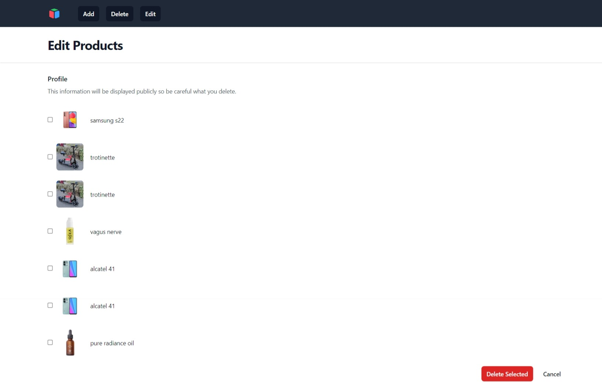
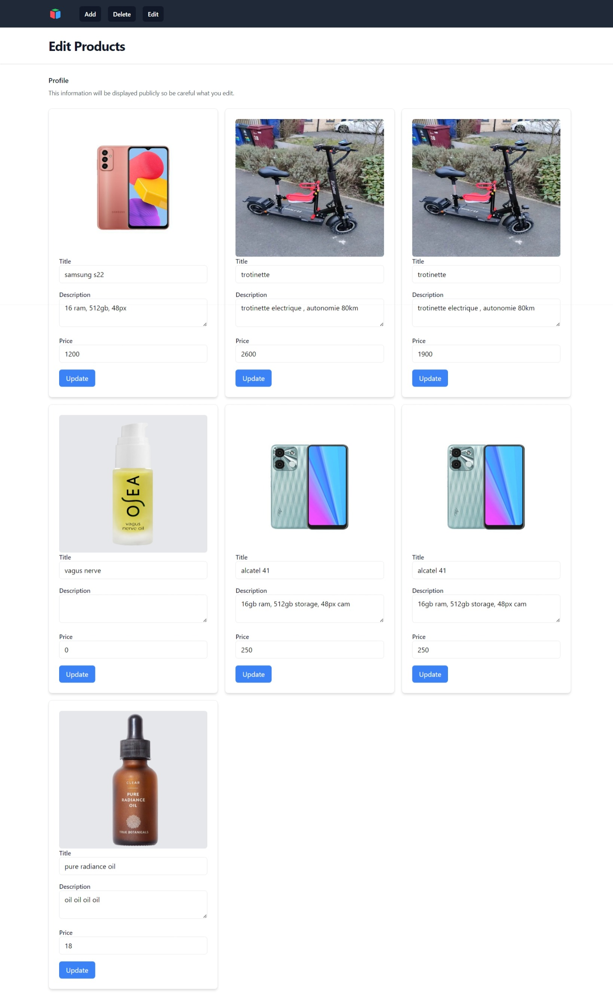

# Projet de Refactoring Avito

## Aperçu

Avito souhaite améliorer son site d'annonces en repensant ses structures. Ce projet implique différentes étapes, de la conception de diagrammes à l'utilisation de scripts PHP et MySQL pour la gestion de la base de données.

## Structure du Projet

### 1. Diagramme de Cas d'Utilisation

- Fichier : `use_case_diagram.png`

Description : Ce fichier contient le diagramme de cas d'utilisation illustrant les diverses interactions entre les utilisateurs et le système.

### 2. Diagramme de Classes

- Fichier : `class_diagram.png`

Description : Ce fichier contient le diagramme de classes décrivant les classes essentielles et leurs relations pour le site Avito annonces.

### 3. Initialisation de la Base de Données

#### Fichiers :

- `connection.php`
- `db.sql`

Description : Ces fichiers contiennent le code PHP et MySQL nécessaire pour initialiser la base de données en fonction des modèles précédemment définis. Assurez-vous d'avoir une configuration correcte du serveur MySQL.

### 4. Insertion de Données

#### Fichier :

- `dashboard.php`

Description : Ce fichier inclut le code PHP pour insérer des données dans la base de données à l'aide d'un formulaire. Les utilisateurs peuvent interagir avec le formulaire pour ajouter de nouvelles entrées dans le système.

### 5. Suppression de Données

#### Fichier :

- `delete.php`

Description : Ce fichier inclut le code PHP pour supprimer des entrées spécifiques (`delete.php`).

### 6. Modification de Données

#### Fichier :

- `edit.php`

Description : Ce fichier contient le code PHP pour modifier des données existantes dans la base de données. Les utilisateurs peuvent interagir avec cette fonctionnalité pour modifier des informations selon leurs besoins.

### 7. Application Principale

#### Fichiers :

- `index.php`

Description : Le fichier principal pour le site Avito annonces. Il devrait inclure le code nécessaire pour l'interaction utilisateur et la présentation des données. Assurez-vous que tous les autres fichiers et fonctionnalités sont inclus correctement.

### 8. Affichage du Site Web

#### Captures d'Écran :

*Page d'accueil du site Avito*

*Exemple de la page du tableau de bord*

*Exemple de la page de suppression des annonces*

*Exemple de la page de modification des annonces*

## Utilisation

1. Clonez le dépôt : `git clone https://github.com/oussamaef06/Brief5.git`
2. Configurez votre serveur MySQL et ajustez les informations d'identification dans `connection.php`.
3. Exécutez les scripts SQL dans `db.sql` pour initialiser la base de données.
4. Accédez au fichier `index.php` dans un navigateur web pour interagir avec le site Avito annonces.

## Contributeurs

- [Elfarihi Oussama]

N'hésitez pas à contribuer au projet en soumettant des pull requests ou en signalant des problèmes.

## Licence

Consultez le fichier [LICENSE.md](LICENSE.md) pour plus de détails.
